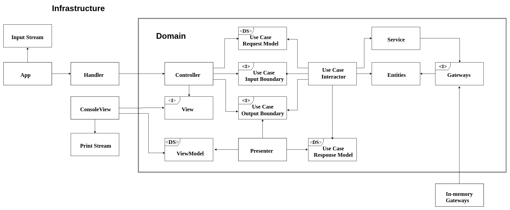

# Social Networking Kata

This is a Java implementation of a console-based social networking application.

This project was created for practice purposes and it is not intended to be used for real. 


## Kata Description
The exercise description can be checked [here](kata_description.txt).


## Build and Run

**System Requirements:** Java 8 and Maven are required to build an run the project.

### Building the project
Open the terminal, navigate to the project folder and execute:
```sh
mvn clean package
```

This will generate a *socialnetworking-0.0.1-SNAPSHOT.jar* file inside the *target* folder

### Runnning the project
After building the project, execute the command below to run the application:
 ```sh
 java -cp target/socialnetworking-0.0.1-SNAPSHOT.jar com.lucasmafra.socialnetworking.infrastructure.console.main.App
 ```

## About the implementation

* In the application design, I used many of the concepts presented in the [Clean Architecure](https://8thlight.com/blog/uncle-bob/2012/08/13/the-clean-architecture.html) book by Uncle Bob.
Despite the fact that this is only a small project with few requirements, I wanted to exercise how to build an application
agnostic to details like databases and IO devices.

* I also wanted to practice an Outside-in approach to TDD. I started with an acceptance test for the posting feature,
then I moved to the timeline feature, and so on. I focused on getting each feature completely done before moving to
the next one.  

* A great feedback that I got from my code with this approach is that the "package by layer" style
that I was using in the project was not so good, since I had to transverse many folders and layers just to get a feature done. 
So I decided to take a different way of structuring the packages. I abandoned the "core, data and presentation" horizontal layering
and divided the code into two worlds: the "inside" (domain) and the "outside" (infrastructure). Here is an diagram illustrating the application architecture: 

 
 
 
The \<**I**> symbol represents *interfaces*, while the \<**DS**> 
represent simple *data structures*. An arrow from A to B means that A 
knows about B but B does not know about A. It is very cool how dependency allways goes from the outside world to the inside - never the other way around.

 ## Things that I'm not happy about
 
 * I couldn't find an appropriate place to put my custom Clock (I wanted to take full control of it). 
 It was the same for the ElapsedTimeFormatter. The only thing that I knew was that I had to keep them inside
 the domain package so I would not break the dependency rule. I end up moving them to an "utilities" folder.
 
 * I feel like I still have that "horizontal layering" thinking. It was very hard to me to put the controller, presenter and view-model
 in the domain package inside each use case. What comforts me is 1) since I'm inverting dependencies 
 they all remain agnostic about the delivery system 2) it makes really easier to write and change the 
 feature since almost all the files are in the same package 3) it's nice to have less files in the 
 infrastrucutre folder, after all, it should contain only some "glue code". But still, it's hard.
 
 * I have serious doubts about the role that the services should play. They don't explicitly know nothing about the
 data storage mechanism, since they collaborate with the Gateway interface, but I feel like they are implicitly assuming certain
 things about the data storage. For example: the WallService collaborates with the FollowGateway and
  the PostGateway to return the user wall. They do that by getting the posts of the user, then his followings, then his followings posts,
  and finally they combine those posts and return them. That clearly can bring some perfomance issues. So let's say that now we decide to use a
  new strategy on how we storage the data. Let'say that, whenever a user that you follow makes a post, we'll 
  create a reference for that post somewhere in the memory dedicated to your wall, so that we don't have to "calculate" the wall on the fly every time a user requests it.
  How can we address that change in our code? We would certainly have to change our Wall Service. We would probably have to change the Timeline Service
  as well, since it would have to do something more when calling "post to timeline" method. So, basically, we would be
  changing things in the domain in the name of perfomance. That doesn't feel right to me. At all. What comforts me, again, is that
  we are not breaking the dependency rule, at least explicitly. Also, I think it could be overengineering to antecipate that kind of problem. Yet, it is a point to think about. 